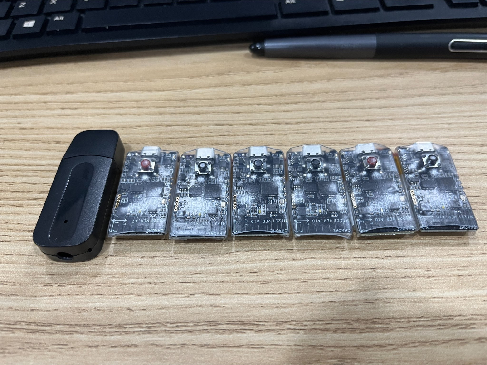
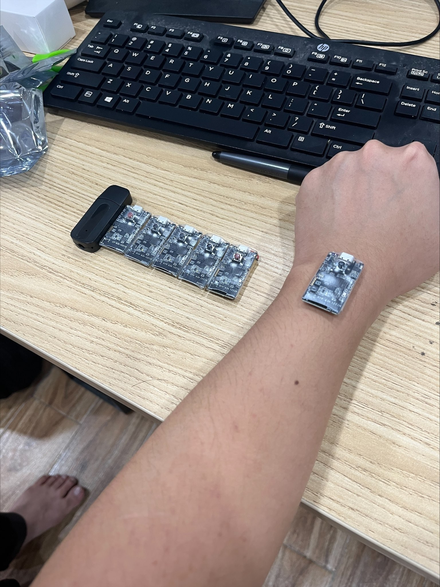
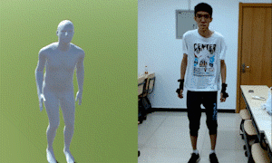

# HiPNUC-Hi229
Read and process data from IMU Hi229

  

The set of sensors is sponsored by HiPNUC company. Worth about 300$

Here is a demo of using accelerometer to predict human pose - Motion Capture

## Development project for application in VR chat and film making

<video src="data/1.mp4" controls="controls" style="max-width: 730px;">
</video>

<h1> Functions
   <h2> 1. Setup AT Command with multiple devices</h2>
   <h2> 2. Read data from Hi299 </h2>
   <h2> 3. Convert Euler to Rotation Matrix </h2>
</h1>

